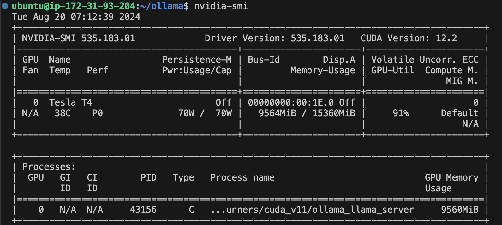

是的，根据提示，你需要安装 NVIDIA 驱动程序和相关工具以使你的 EC2 实例能够使用 GPU。以下是你可以执行的步骤来安装并配置这些工具。

### 1. 选择并安装合适的 NVIDIA 驱动

在你的 Ubuntu 22.04 系统上，你可以选择合适的 NVIDIA 驱动进行安装。推荐选择最新版本的驱动来支持更多的 GPU 特性。

```bash
sudo apt update
sudo apt install nvidia-utils-535
```

这里选择了 `nvidia-utils-535`，因为它是列表中提供的最新版本（这可以通过运行nvidia-smi发现）。如果你有特定的要求，可以选择其他版本。

### 2. 安装 NVIDIA 驱动和 CUDA 工具包

在安装完 `nvidia-utils` 后，还需要安装完整的 NVIDIA 驱动程序和 CUDA 工具包。

1. **安装 NVIDIA 驱动**：

   ```bash
   sudo apt install -y nvidia-driver-535
   ```

   如果你想安装特定版本，可以将 `535` 替换为其他版本号。

2. **安装 CUDA 工具包（可选）**：

   如果你需要 CUDA 开发工具，比如用于运行深度学习模型，可以安装 CUDA：

   ```bash
   sudo apt install -y nvidia-cuda-toolkit
   ```

### 3. 验证安装

安装完成后，重新启动系统，然后使用 `nvidia-smi` 命令验证安装是否成功：

```bash
sudo reboot
```

重新连接到实例后，运行：

```bash
nvidia-smi
```

如果安装正确，你应该会看到类似下面的输出，显示 GPU 的使用情况、驱动版本和 CUDA 版本等信息。

### 4. 安装 NVIDIA Docker 工具（如果需要）

如果你计划在 Docker 容器中使用 GPU，需要安装 NVIDIA Docker 工具：

```shell
# 确保错误的文件先被删除
sudo rm /etc/apt/sources.list.d/nvidia-docker.list
```


```shell
distribution=$(. /etc/os-release;echo $ID$VERSION_ID)

curl -fsSL https://nvidia.github.io/libnvidia-container/gpgkey | sudo gpg --dearmor -o /usr/share/keyrings/nvidia-container-toolkit-keyring.gpg

curl -s -L https://nvidia.github.io/nvidia-container-toolkit/$distribution/nvidia-docker.list | \
  sed 's#deb https://#deb [signed-by=/usr/share/keyrings/nvidia-container-toolkit-keyring.gpg] https://#g' | \
  sudo tee /etc/apt/sources.list.d/nvidia-docker.list

```


```bash
sudo apt update
sudo apt install -y nvidia-docker2

# Configure Docker to use Nvidia driver
sudo nvidia-ctk runtime configure --runtime=docker

sudo systemctl restart docker

# 验证 NVIDIA Docker 是否正确安装：
sudo docker run --rm --gpus all nvidia/cuda:12.6.0-base-ubuntu22.04 nvidia-smi
```


下图应该是没有成功使用GPU来做Ollama的推理。


下图是正确的可以使用Ollama推理：



### 5. 测试 GPU

你可以通过运行一些简单的 CUDA 示例或使用 TensorFlow/PyTorch 测试 GPU 是否正常工作。

### 总结

通过安装 `nvidia-utils`、NVIDIA 驱动程序、CUDA 工具包，以及配置 NVIDIA Docker 工具，你的 EC2 实例将能够支持 GPU 加速，并可以运行相关的 GPU 工作负载。安装完成后，使用 `nvidia-smi` 确认 GPU 已正确配置。

==


在 EC2 的 Ubuntu 实例上安装 Docker 环境的步骤如下：

### 1. 更新包管理器

首先，更新你的包管理器以确保所有软件包都是最新的：

```bash
sudo apt-get update
sudo apt-get upgrade -y
```

### 2. 安装必要的依赖

在安装 Docker 之前，先安装一些必要的依赖包：

```bash
sudo apt-get install -y apt-transport-https ca-certificates curl software-properties-common
```

### 3. 添加 Docker 的官方 GPG 密钥

当你看到 `apt-key` 已被弃用的警告时，这意味着 Ubuntu 正在逐步淘汰传统的 `apt-key` 工具，并建议使用更安全的密钥管理方式。为了避免未来的兼容性问题，你可以按照以下步骤来处理 Docker GPG 密钥的添加，而不使用 `apt-key`：

### 新的方法：使用 `gpg` 和 `apt-key` 的替代方法

1. **创建密钥环目录（如果不存在）**：
   
   你可以将 GPG 密钥直接添加到 `/usr/share/keyrings` 目录下，而不是使用 `apt-key`。

   ```bash
   sudo mkdir -p /usr/share/keyrings
   ```

2. **下载并保存 Docker 的 GPG 密钥**：

   使用 `curl` 命令直接将 GPG 密钥保存到 `/usr/share/keyrings/docker-archive-keyring.gpg` 文件中：

   ```bash
   curl -fsSL https://download.docker.com/linux/ubuntu/gpg | sudo gpg --dearmor -o /usr/share/keyrings/docker-archive-keyring.gpg
   ```

3. **添加 Docker APT 存储库**：

   在添加 Docker 的 APT 存储库时，指定 `signed-by` 选项以使用刚刚下载的 GPG 密钥：

   ```bash
   echo "deb [arch=amd64 signed-by=/usr/share/keyrings/docker-archive-keyring.gpg] https://download.docker.com/linux/ubuntu $(lsb_release -cs) stable" | sudo tee /etc/apt/sources.list.d/docker.list > /dev/null
   ```

4. **更新包索引**：

   现在你可以更新 APT 的包索引，并安装 Docker：

   ```bash
   sudo apt-get update
   ```

5. **安装 Docker**：

   安装 Docker 社区版：

   ```bash
   sudo apt-get install -y docker-ce docker-ce-cli containerd.io
   ```

这里的 `docker-ce` 是 Docker 社区版（Community Edition）。

### 4. 验证 Docker 安装

你可以通过运行以下命令来验证 Docker 是否正确安装：

```bash
sudo systemctl status docker
```

这个命令将显示 Docker 服务的状态。如果安装正确，Docker 服务应该是运行中的。

你还可以通过运行 `docker` 命令来检查 Docker 是否正常工作，例如：

```bash
sudo docker run hello-world
```

这个命令会下载一个测试镜像并在容器中运行，以验证 Docker 安装是否成功。

### 5. 配置 Docker 以非 root 用户运行（可选）

默认情况下，只有 `root` 用户或 `sudo` 用户可以运行 Docker 命令。如果你希望普通用户（例如 `ubuntu` 用户）也能运行 Docker 命令，而不需要在前面加 `sudo`，你可以将用户加入 `docker` 组：

1. **创建 `docker` 组**：

   ```bash
   sudo groupadd docker
   ```

2. **将你的用户添加到 `docker` 组**：

   ```bash
   sudo usermod -aG docker $USER
   ```

3. **重新登录**：
   - 退出当前会话并重新登录，或者使用以下命令重新加载组权限：

   ```bash
   newgrp docker
   ```

4. **验证用户权限**：
   - 现在，你可以直接运行 Docker 命令而不需要 `sudo`，例如：

   ```bash
   docker run hello-world
   ```

### 6. 设置 Docker 开机启动（可选）

默认情况下，Docker 应该已经配置为在系统启动时自动启动。如果你想手动设置或检查这个配置，可以使用以下命令：

```bash
sudo systemctl enable docker
```

### 7. 安装 Docker Compose（可选）

如果你需要使用 Docker Compose 来管理多容器应用，可以通过以下步骤安装：

1. **下载最新版本的 Docker Compose**：

   ```bash
   sudo curl -L "https://github.com/docker/compose/releases/download/$(curl -s https://api.github.com/repos/docker/compose/releases/latest | grep 'tag_name' | cut -d\" -f4)/docker-compose-$(uname -s)-$(uname -m)" -o /usr/local/bin/docker-compose
   ```

2. **赋予执行权限**：

   ```bash
   sudo chmod +x /usr/local/bin/docker-compose
   ```

3. **验证安装**：

   ```bash
   docker-compose --version
   ```

### 总结

通过以上步骤，你可以在 EC2 的 Ubuntu 实例上成功安装并配置 Docker 环境。Docker 将帮助你轻松管理和部署容器化应用程序。