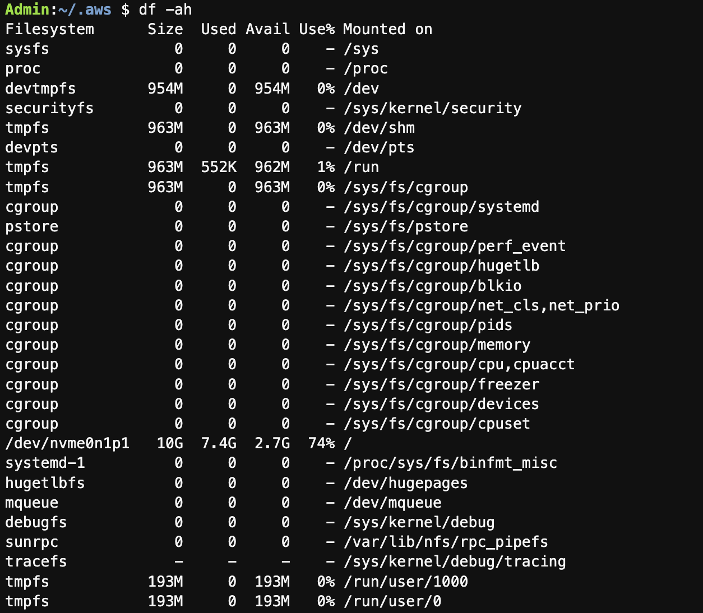
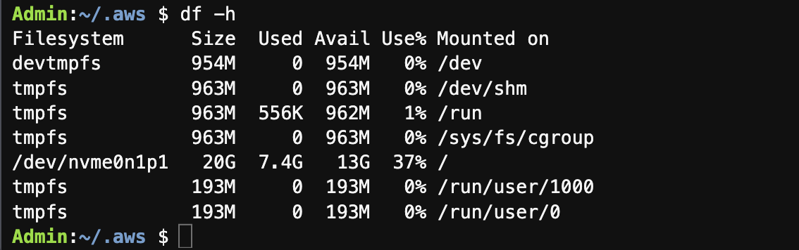

[toc]


## Option 1: Resize AWS Cloud9 root Volume

To build Docker images on AWS Cloud9, you will need to resize the root volume of your AWS Cloud9 instance to at least 20GiB.

You can use the following command on the **AWS Cloud9 terminal** to resize the root volume:

```shell
curl -s https://gist.githubusercontent.com/wongcyrus/a4e726b961260395efa7811cab0b4516/raw/6a045f51acb2338bb2149024a28621db2abfcaab/resize.sh | bash /dev/stdin 20

df -h
```

The screenshots (before and after) are as follows:






## Option 2: Resize Cloud9 Instance Volume

Execute the following commands in Cloud9 terminal, it will expand the disk size.

```shell
wget https://awsj-iot-handson.s3-ap-northeast-1.amazonaws.com/kvs-workshop/resize_volume.sh
chmod +x resize_volume.sh
./resize_volume.sh
```

