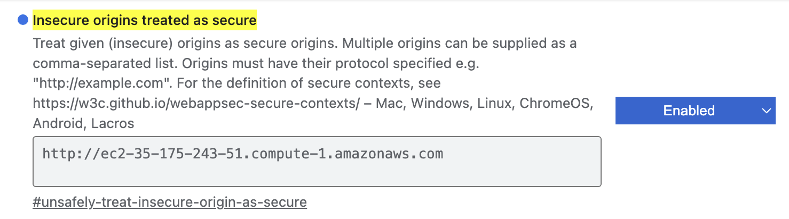

#### Q：关于如何激活麦克风的问题

A：You need https for that. If you use localhost (the server being in the same machine as the one you access the WebUI), you can use it, because most browsers see localhost as a safe address, but if you access remotely, you'll need to be using https.

解决方法之一是在浏览器中打开chrome://flags/#unsafely-treat-insecure-origin-as-secure，然后将这个项目设置为enable，同时把需要浏览器认为安全的域名放到框中，如图，然后点击relaunch

参考链接：

https://github.com/open-webui/open-webui/discussions/3012

https://www.reddit.com/r/OpenWebUI/comments/1ddws1s/open_webui_permission_denied_when_accessing_media/

#### Q：关于在Route53中添加了域名后，通过域名无法访问的问题

A: 发现原因是在浏览器中会自动将http请求转化成https，而webui目前只支持http。暂时放弃了进一步的尝试，并且必须在EC2上使用80端口，而不是3000端口。因为只要使用AWS公司的vpn，就只允许访问ec2的80端口。