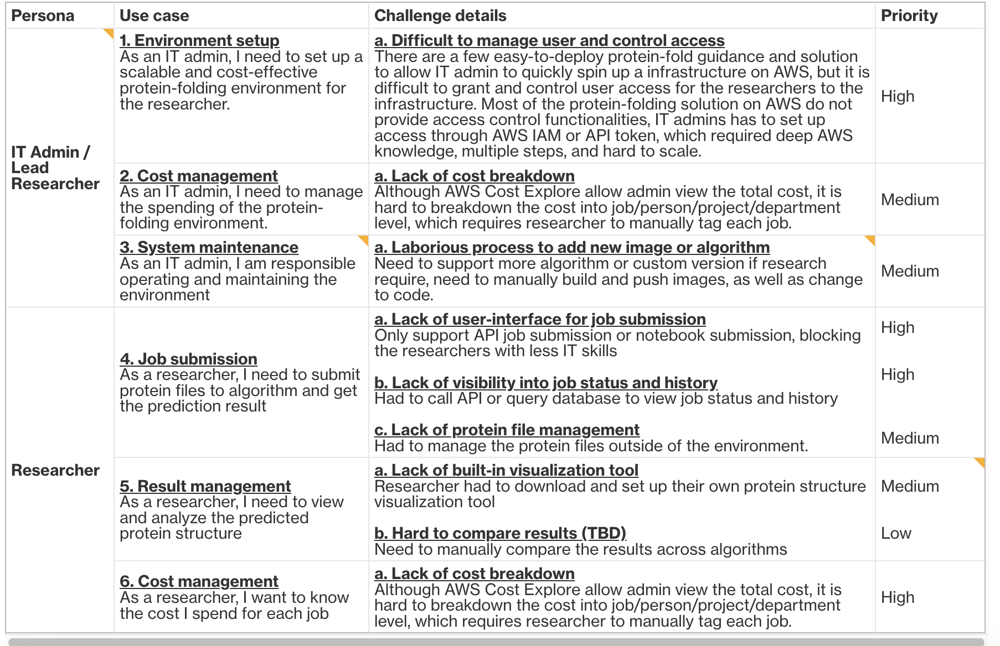

global guidance: https://aws.amazon.com/solutions/guidance/protein-folding-on-aws/

但是这个guidance是通过notebook去操作batch，更多的是传递一种架构，工程化方面做得不够好。

我们升级了这个，增加了：

1. Web ui 替代notebook
2. 提供管理员和研究员两个界面，提供成本管理，账单分拆
3. 提供图形化任务提交，提供任务的可视化

目前的版本是v1.0.0 8/16

正在开发的是v1.1.0 9/20，看上去有一些原本准备在1.2中发布的内容合并到1.1发布了。

