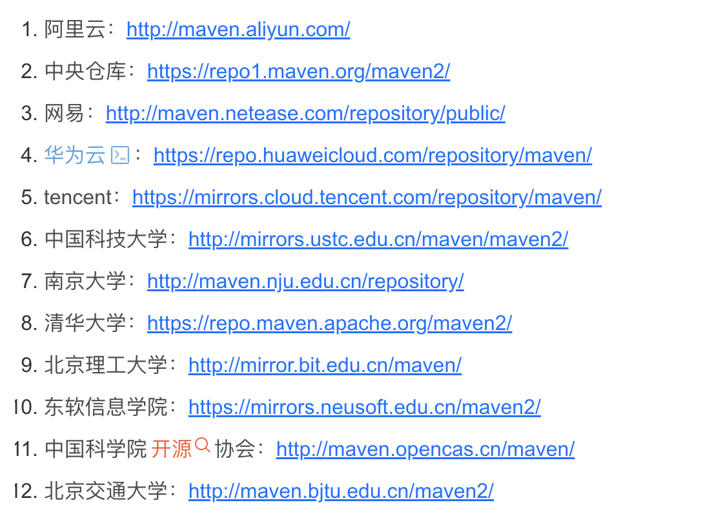

在中国，多个组织和高校提供了开源软件的镜像服务，以加速包管理工具的下载并解决网络限制问题。以下是支持 PyPI、npm、容器镜像以及 Maven/Gradle 的主要国内镜像站：

------

### **1. 支持 PyPI 的镜像站**

- **清华大学 TUNA 镜像站**
  - 地址：`https://pypi.tuna.tsinghua.edu.cn/simple`
  - 说明：提供 PyPI 镜像，加速 Python 包的下载。
- **阿里云开源镜像站**
  - 地址：`https://mirrors.aliyun.com/pypi/simple`
  - 说明：阿里云提供的 PyPI 镜像服务。
- **中国科技大学开源镜像站**
  - 地址：`https://pypi.mirrors.ustc.edu.cn/simple`
  - 说明：中科大提供的 PyPI 镜像服务。
- **华为云开源镜像站**
  - 地址：`https://repo.huaweicloud.com/repository/pypi/simple`
  - 说明：华为云提供的 PyPI 镜像服务。
- **腾讯云开源镜像站**
  - 地址：`https://mirrors.cloud.tencent.com/pypi/simple`
  - 说明：腾讯云提供的 PyPI 镜像服务。

------

### **2. 支持 npm 包下载的镜像站**

- **淘宝 npm 镜像（npmmirror）**
  - 地址：`https://registry.npmmirror.com/`
  - 说明：由淘宝团队维护的 npm 镜像，提供稳定的 npm 包下载服务。

------

### **3. 支持容器镜像的镜像站**

- #### DaoCloud 镜像站

  - 网址：[道客云](https://link.juejin.cn?target=https%3A%2F%2Fdocker.m.daocloud.io)
  - 特点：支持GCR、K8S、GHCR、Quay、NVCR 等
  - 模式：白名单模式、限流
  - 是否免费：免费

  #### 阿里云镜像

  - 网址：[阿里云镜像](https://link.juejin.cn?target=https%3A%2F%2Fcr.console.aliyun.com%2F)
  - 特点：需要注册登录，分配个人实例镜像，有限量，个人够用
  - 是否免费：免费
  - 备注：很多人反映阿里云的镜像很老没有更新，但个人实际使用中表现正常

  

#### Amazon ECR Public Gallery

- 网址：[Amazon ECR](https://link.juejin.cn?target=https%3A%2F%2Fpublic.ecr.aws)
- 特点：由Amazon提供的公共Docker镜像库，具有高可用性，支持Docker Hub、GCR、Quay等
- 是否免费：免费

#### TimeWeb Docker Hub Mirror

- 网址：[TimeWeb ](https://link.juejin.cn?target=https%3A%2F%2Fdockerhub.timeweb.cloud%2F)
- 特点：TimeWeb提供的Docker Hub镜像，易于使用。
- 是否免费：免费

#### Yandex Docker Hub Mirror

- 网址：[Yandex ](https://link.juejin.cn?target=https%3A%2F%2Fcr.yandex%2Fmirror)
- 特点：俄罗斯Yandex提供的Docker镜像库，支持Docker Hub。
- 使用方式：docker pull cr.yandex/mirror/nginx 不支持配置到 daemon.json
- 是否免费：免费

#### GitVerse Docker Hub Mirror

- 网址：[GitVerse](https://link.juejin.cn?target=https%3A%2F%2Fdh-mirror.gitverse.ru)
- 特点：GitVerse提供的Docker Hub镜像，快速访问。
- 是否免费：免费

#### Beget Docker Hub Mirror

- 网址：[Beget](https://link.juejin.cn?target=https%3A%2F%2Fdockerhub1.beget.com)
- 特点：Beget提供的Docker Hub镜像，支持Docker Hub。
- 是否免费：免费
- 

#### NooSoft Docker Hub Proxy

- 网址：[NooSoft](https://link.juejin.cn?target=https%3A%2F%2Fnoohub.ru)
- 特点：NooSoft提供的Docker Hub代理服务，支持Docker Hub。
- 是否免费：免费

#### JockerHub

- 网址：[DpkgSoft](https://link.juejin.cn?target=https%3A%2F%2Fjockerhub.com)
- 特点：DpkgSoft提供的Docker Hub代理服务，专为俄罗斯用户设计，支持Docker Hub。
- 是否免费：免费

#### Red Hat Container Catalog

- 网址：[Red Hat Container Catalog](https://link.juejin.cn?target=https%3A%2F%2Fregistry.access.redhat.com)
- 特点：Red Hat提供的容器镜像库，适合企业级使用。
- 是否免费：部分免费

#### Red Hat Ecosystem Catalog

- 网址：[Red Hat Ecosystem Catalog](https://link.juejin.cn?target=https%3A%2F%2Fregistry.redhat.io)
- 特点：Red Hat生态系统目录，提供多种企业级容器解决方案，支持Docker Hub、GCR、Quay等。
- 是否免费：部分免费

在GitHub上有很多项目，可以帮助您使用免费的Cloudflare Worker/pages 或自己的主机自建Docker镜像加速器。以下是几个Star数较高的项目：

### 1.[CF-Workers-docker.io](https://link.juejin.cn?target=https%3A%2F%2Fgithub.com%2Fcmliu%2FCF-Workers-docker.io)

这个项目是一个基于Cloudflare Workers的Docker镜像代理工具，能够中转对Docker官方镜像仓库的请求，解决访问限制和加速访问的问题。

### 2. [cloudflare-docker-proxy](https://link.juejin.cn?target=https%3A%2F%2Fgithub.com%2Fciiiii%2Fcloudflare-docker-proxy)

这是另一个基于Cloudflare Workers的Docker镜像代理项目，支持一键部署。

### 3.[Docker-Proxy](https://link.juejin.cn?target=https%3A%2F%2Fgithub.com%2Fdqzboy%2FDocker-Proxy)

自建Docker镜像加速服务，基于官方Docker Registry，一键部署Docker、K8s、Quay、Ghcr、Mcr等镜像加速和管理服务。支持部署到Render。

### 4.[Hammal](https://link.juejin.cn?target=https%3A%2F%2Fgithub.com%2FImSingee%2Fhammal%3Ftab%3Dreadme-ov-file)

这个项目是另一个基于Cloudflare Workers的Docker镜像加速工具，用于解决获取Docker官方镜像无法正常访问的问题。

------

### **4. 支持 Maven/Gradle 的镜像站**

------

